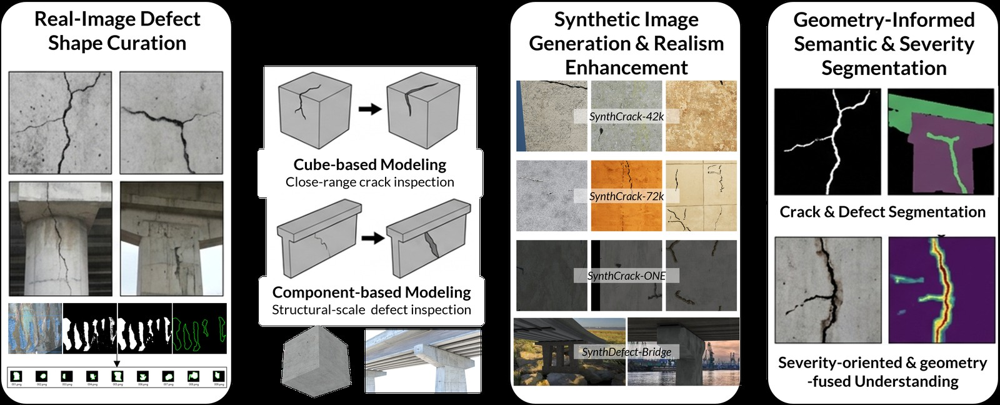

# DefectSynth

**基於幾何資訊的合成資料生成 — 混凝土損害檢測**

[論文 (即將公開)](#) | [專案頁面](https://huhuman.github.io/rhino-defect-synth/) | [資料集](#資料集)

---

## 概述

本儲存庫提供一套參數化 3D 損害建模與多通道渲染流程，用於生成合成混凝土檢測資料。損害形狀源自真實檢測影像，轉換為可控制尺度、方向、深度與位置的 3D 模型。流程在 Rhino 中渲染對齊的 RGB、深度、表面法向量與遮罩輸出，同時支援近距離裂縫檢測與結構尺度橋梁損害場景。

<p align="center">
  
</p>

## 建模策略

### 立方體裂縫建模 (Cube-based)

以六面立方體作為近距離裂縫場景的載體。來自真實影像資料庫 (CrackSeg9k) 的裂縫遮罩，以參數化的尺度、方向與位置放置於立方體表面。裂縫嚴重程度透過像素-公制轉換，依據 FHWA 寬度門檻指定。

### 橋梁元件損害建模 (Component-based)

根據道路中心線與結構設計規範 (IDOT Bridge Manual) 生成參數化橋梁元件（橋面板、橋墩、大梁、欄杆、支承）。裂縫、剝落、腐蝕（裸露鋼筋）與白華等損害遮罩放置於元件表面，依檢測標準指定嚴重程度。各損害類別以對應的 3D 操作建模：表面侵蝕（剝落）、裸露鋼筋（腐蝕）、表面沉積物（白華）。

## 資料集

| 資料集 | 影像數 | RGB | Depth | Normal | Mask | 描述 |
|--------|-------:|:---:|:-----:|:------:|:----:|------|
| [SynthCrack-42k](https://drive.google.com/file/d/1GFyQyNLw3Y7Qob-9uSbFTI0EfKJnBjpp/view?usp=sharing) | 42,165 | ✓ | | | ✓ | 基準立方體裂縫資料集 (Unreal Engine) |
| [SynthCrack-72k](https://drive.google.com/file/d/1Rcjdk8jVy-8KQ1VIYXatUmWe_ZfOTx_3/view?usp=sharing) | 71,860 | ✓ | | | ✓ | 擴充裂縫形狀 + 更新幾何參數化 |
| [SynthCrack-ONE](https://drive.google.com/file/d/1_HUhw3TwORQEO-hbxrYxrBlWnlyGBpYs/view?usp=sharing) | 23,485 | ✓ | ✓ | ✓ | ✓ | Rhino 生成，精煉裂縫形狀庫 |
| [SynthDefect-Bridge](https://drive.google.com/file/d/1umZxzBGUBRo36vlRug52WZgzZxE9gegZ/view?usp=sharing) | 2,291 | ✓ | ✓ | ✓ | ✓ | 橋梁尺度多損害：裂縫、剝落、腐蝕、白華 |
| RealDefect-Bridge | TBD | ✓ | | | ✓ | 真實橋梁檢測影像（評估用，即將公開） |

> SynthCrack-ONE 與 SynthDefect-Bridge 包含對齊的深度與表面法向量通道。

## 需求

- **Rhino 8** (Windows) 並啟用 Python scripting
- Rhino Python 中需安裝 **PyYAML** 與 **numpy**
- **rhino_channels_plugin**（已附於本 repo）用於線性深度/法向量 `.pfm` 輸出

## 快速開始

```python
import main
main.run(
    config_name="cube_render.yaml",
    stages=["load_config", "preparation", "view_setup", "modeling", "rendering"],
)
```

批次資料集生成：

```python
import main_cube_batch
main_cube_batch.run(
    config_name="cube_render.yaml",
    renders_per_model=4,
    max_iter=3,
    seed=42,
)
```

完整設定、流程階段與輸出結構請參閱 [Pipeline 文件](docs/PIPELINE.zh-TW.md)。

## 下游應用

生成資料的可行性已透過跨資料集損害分割、非配對真實感增強 (CycleGAN / CUT)，以及幾何資訊引導的師生學習進行驗證。詳情請參閱[論文](#)。

## 引用

```bibtex
@article{hsu2026defectsynth,
  title={Beyond Cracks: Synthetic Image and Geometry Generation for Computer Vision Detection and Severity Assessment of Diverse Concrete Surface Defects},
  author={Hsu, Shun-Hsiang and Golparvar-Fard, Mani},
  journal={Automation in Construction},
  year={2026},
  note={Preprint}
}
```

## 文件

- [Pipeline Documentation (EN)](docs/PIPELINE.md)
- [Pipeline Documentation (中文)](docs/PIPELINE.zh-TW.md)
- [Rhino Channels Plugin](rhino_channels_plugin/README.md)
